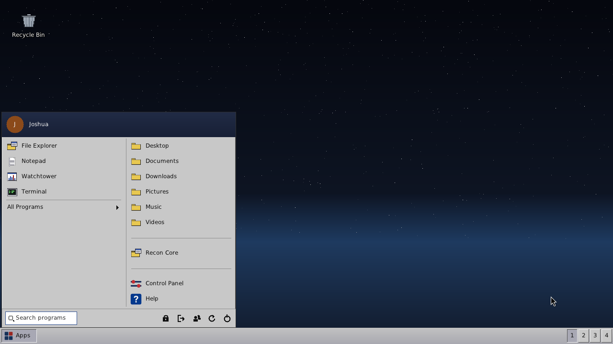
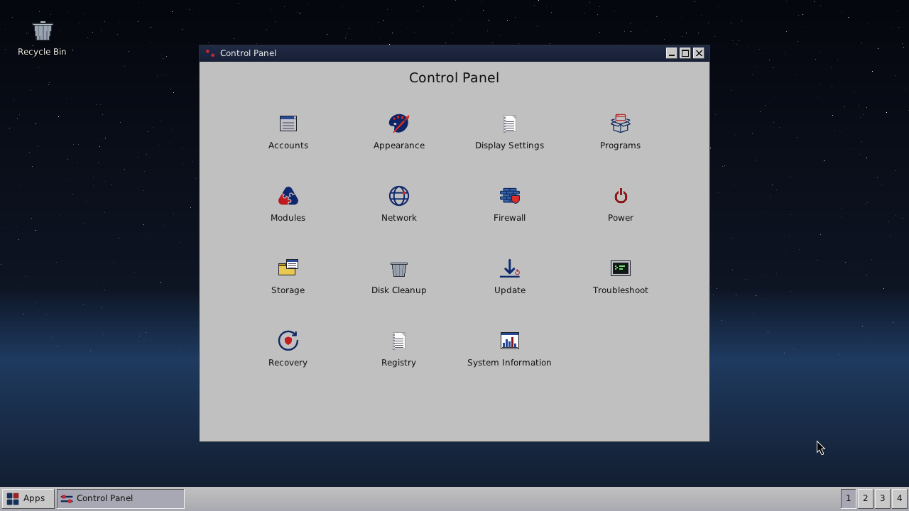
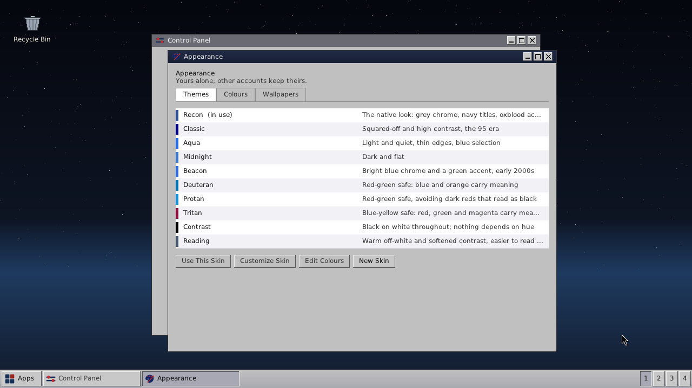
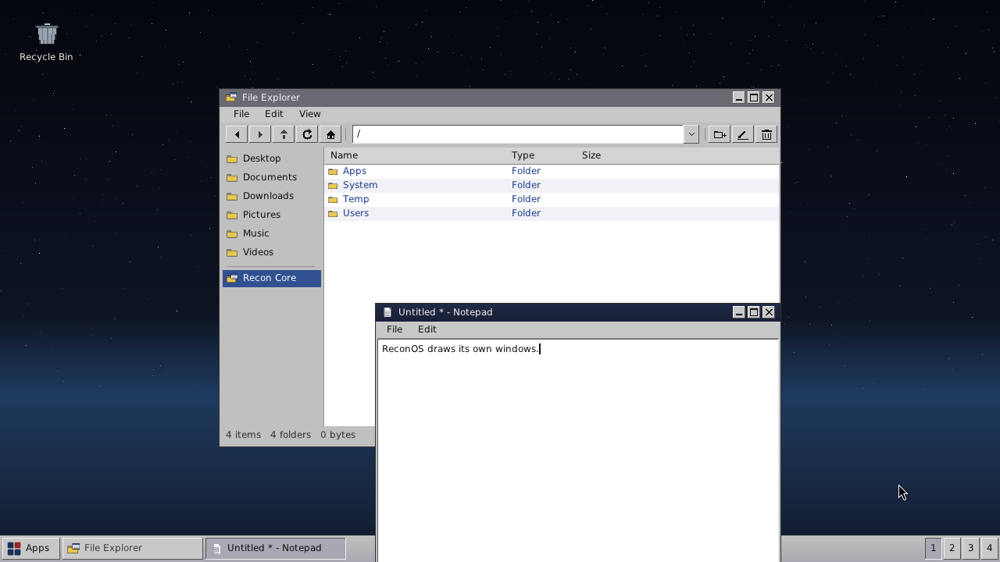
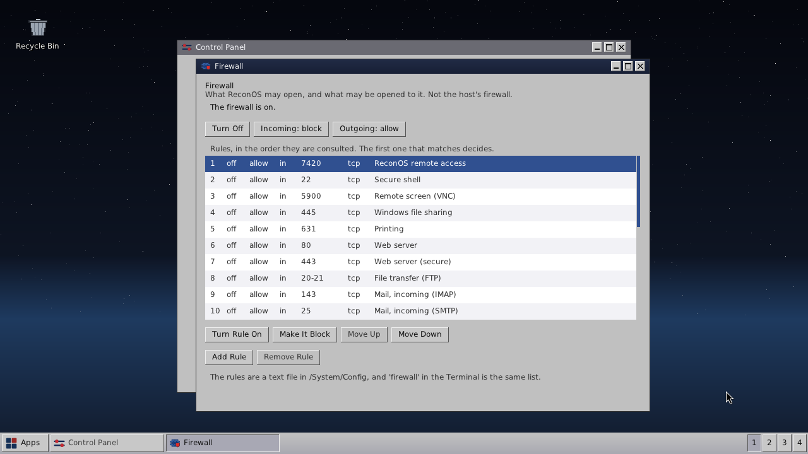
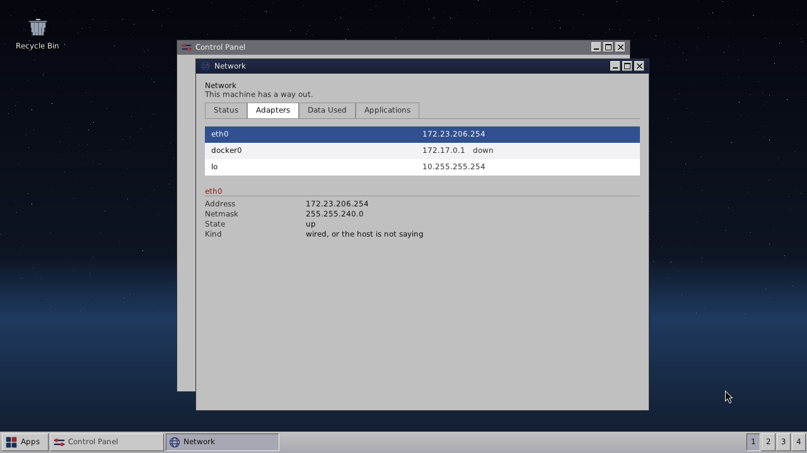
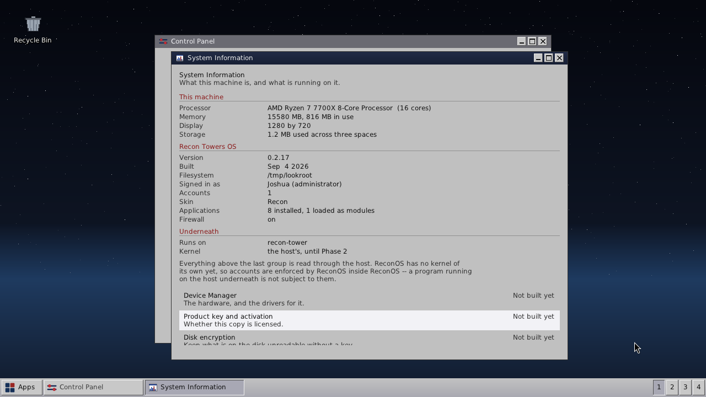

# ReconOS

A Wayland compositor and desktop shell, built from scratch in C on [wlroots](https://gitlab.freedesktop.org/wlroots/wlroots).

ReconOS is the first phase of a longer project: an operating system built up
from its own parts rather than assembled from someone else's. Phase one is the
part you actually see and touch — the compositor, the window management, the
shell. It runs on the Linux kernel today; replacing that substrate comes later,
once the layer above it is worth running.

**Status: v0.2.17.** The version number tracks what works, not what is
planned.

v0.1.0 was the milestone defined as "a usable desktop": it sets itself up on
first run, asks who you are on every run after, and gives that person a desktop
of their own. v0.1.1 made that last part true -- see *One account at a time*
below -- and put the shape of the rest of the system into the Control Panel,
most of it marked plainly as not built yet. v0.1.2 and v0.1.3 are the rounds
that came out of somebody actually using it: setup that looks like it belongs
to something, accounts with faces, a login that asks who you are before it
asks anything else, and a long list of things that were wrong once a person
clicked them.

v0.2.0 added the first networking: ReconOS can see the network and reach
across it. It does not implement one -- see *The network* below, which is
blunt about the difference. v0.2.1 added connections that carry data, the
rule about which programs may open one, screen capture, installing and
removing programs, and wallpapers the system draws for itself. v0.2.2 gave
the Start menu an All Programs list and restricted the control socket to the
account that owns it. v0.2.3 added gradients to the skin system, a boot
splash, and fixed the unreadable labels that finding the gradients turned up.
v0.2.4 made skins installable, which the file format had been waiting for
since the skin system was built. v0.2.5 made the registry changeable from the
Control Panel rather than only readable there. v0.2.6 added window snapping,
and fixed Alt+Tab, which had been quietly dead since ReconOS started drawing
its own windows. v0.2.7 added four desktops, which was the last thing the
Multitasking page said was missing. v0.2.8 made Properties work, and made the
explorer and the properties box agree about how big a file is and what it
is. v0.2.9 let desktop icons be moved and remembered, and made a file open
when you click it — which nothing in the system did before. v0.2.10 let a
skin set the *shape* of a window frame and not only its colours, and v0.2.11
gave Notepad undo and a menu to find it in. v0.2.12 added a text clipboard,
which the system did not have at all. v0.2.13 came out of watching it run:
removing an account can now take its files, and the Start menu's footer is
icons rather than five words. v0.2.14 gave programs a way to arrive: a
package format with a manifest and a receipt, so an install can place more
than one file and removing it takes back exactly what it placed. v0.2.15
gave the system a way to explain itself: a Help application holding both the
written help and the change log, and a window that says what changed the
first time an account reaches the desktop on a new version. It also made
Storage work, gave the Recycle Bin a command so it can be reached from
outside a window, settled on one button shape for the whole system, let the
Start menu be typed into, and -- at last -- let a skin be written from
inside ReconOS rather than only installed into it. v0.2.16 gave the system a
way to say what went wrong and a boundary around what it opens: error codes
with a screen and a log, a firewall, a startup screen that checks rather
than counts, and remote access two ways.

[docs/ROADMAP.md](docs/ROADMAP.md) has the full plan, what each version did,
and the list of what is known to be missing.
[docs/BUGS.md](docs/BUGS.md) has every fault ever found in it -- what it
actually was, how it surfaced, who found it, and what was done about it --
and every entry is also a
[GitHub issue](https://github.com/neogentrics/ReconOS/issues).

Still early. There is no kernel of its own, and the account roles are
enforced by ReconOS inside ReconOS rather than by anything underneath it. What is here works and is tested; what
is not here is listed at the end.

## What it looks like

Every one of these is a real screen capture of a running ReconOS, taken by
ReconOS's own `capture` command with the system driven over its control
socket. Nothing here is a mock-up, and nothing is arranged by hand -- the
script that takes them is the same harness the tests use, so a picture that
stops being true stops being taken.



The desktop and the Start menu: pinned programs on the left, the places that
belong to the account on the right, All Programs with a fly-out beside it, and
a search box in the footer. The bar along the bottom carries one button per
window and four desktops at the right end.



The Control Panel is fourteen icons. Clicking one opens it in a window of its
own, named for the item and stepped clear of whatever opened it, so two
settings can be worked on side by side. Hovering one says what it is for.



Ten skins ship, including three for colour vision and one for reading. A skin
sets forty-eight semantic roles, the shape of a window frame, and a wallpaper.
Any of them can be copied and changed; none of them can be deleted, because a
preset that can be deleted is gone with nowhere to get it back from.



ReconOS draws its own windows: the frames, the title bars, the buttons, the
menus. The File Explorer is looking at the root of the ReconOS filesystem,
which is a real directory tree on disk.



A rule list rather than a page about one -- consulted in order, first match
decides, and the ports most people would want are already written down and
switched off. The rules are a text file, and the same list is reachable from
the terminal.



Network in four sections. This is Adapters: every interface the host has, and
for the one picked, its address, netmask, state and kind.



What the machine is, what ReconOS is, and what is underneath -- three groups,
kept apart on purpose, because the third is what explains how the first is
readable at all.

## What works right now

**It announces itself.** A splash with the Recon Towers mark, two rings
turning around it at different speeds, and a line naming each part of the
system as it is counted — icons, skins, wallpapers, applications, accounts.
Those are real numbers rather than a bar pretending to drive work that has
already finished, so a zero means something is genuinely missing.
`RECONOS_NO_SPLASH` skips it.

**It sets itself up.** A system with no accounts walks through five short
screens: welcome, who you are, what the machine is called, whether anything
about reading or colour needs adjusting, and how it should look. The
accessibility list is only shown to somebody who says they want it -- asking
everybody to rule out six conditions before they can use their computer is the
wrong shape for a question most people answer "none of these" to. The skin
list shows a small picture of each skin, drawn from that skin's own palette.

Every run after that asks **which account** first -- a grid of faces with a
name and role under each, and nothing about how any of them signs in. Choosing
one goes to that account's own screen: their picture, their name, their role,
and a password box. It asks even when there is one account, because a single
account with its password box already open tells whoever is standing at the
machine how to get in before they have chosen anything. Signing out returns
to it.
Signing in as a *different* person ends the previous one's windows, because
the whole point of a login screen is that one account does not see another's
open documents. **Lock** covers the screen without ending the session, so the
account stays signed in with its windows open and coming back is the same
desktop.

**Every account has a face.** A set of pictures ReconOS draws for itself at
first run, written into `/System/Icons` like every other icon so a photograph
dropped over one replaces it. An account that has not chosen gets a coloured
disc with its initial, the colour worked out from the name so it is stable
without being stored anywhere.

**One account at a time, properly.** Each account gets its own settings
hive, its own folders, and its own windows. A limited account cannot read
another account's files, only administrators can; and signing in as a different
person ends the previous person's windows rather than handing them over. This
did not work in v0.1.0 -- the hive was written per account and read once at
boot, and application windows were built once and reused -- so the second
person to sign in got the first one's File Explorer, still in their folder.

**A Start menu** in two columns: applications on the left, places and the
Control Panel on the right, who is signed in across the top, and Lock / Sign
Out / Switch User / Restart / Shut Down along the bottom. Lock covers the
screen without ending the session: the account stays signed in, the windows
stay open, and coming back is the same desktop.

The left column is the six applications this account opens most, counted per
account since which programs somebody reaches for is a fact about them rather
than about the machine. **All Programs** at the foot of it lists everything
installed, alphabetically. The two are not the same list truncated: the column
answers what you use, All Programs answers what is here, and only one of those
is in an order you can search by name.

**Typing narrows it.** The menu took no keys at all before v0.2.15 -- not even
Escape -- so the only way to reach an application was to find its name with the
mouse. Now typing filters the list, the arrows move the highlight, Enter opens
it, and Escape steps back one thing at a time: what was typed, then the long
list, then the menu.

**A Control Panel** with thirteen pages. Nine do something: Accounts,
Appearance, Reading, Programs, Modules, Storage, Update, Registry, About. Modules
loads and unloads code in the running system and says why anything refused to
load.

Storage walks what ReconOS owns and says where the room went -- the system,
the programs, each account by name, the scratch space and the Recycle Bin --
and can empty the bin. The bars are a share of the total rather than of a
disk: without a volume layer there is no capacity to be a fraction of, and
drawing one anyway would be inventing the number the page opens by saying it
does not have.

The Registry page asks for the administrator's password before showing what
the system remembers, locks itself again when you leave it, and can change
what it shows — the key of an existing setting is not editable, because a key
you can type over is a rename, and a rename here is a delete and an add that
look like one act. Saving redraws everything, since a setting here is one
something is already using: set `theme` by hand and the desktop restyles
while you watch.

The other three -- Power, Troubleshoot and Recovery -- are there and say
plainly that they are not built, and what has to exist first. So do the parts
of Storage that need more than one volume to mean anything, and the parts of
Update that need somewhere to fetch one from.

Update says what version is running, whether the installed version matches it,
and the first few lines of what this version brought, with a way through to
the whole log in Help. Usually a kernel: a hosted
process cannot suspend a machine, partition a disk, or reinstall itself. A
gap nobody can see is a gap nobody remembers.

The Control Panel is built into ReconOS rather than shipped as a module,
deliberately: this is where somebody goes to repair a system, and it should not
be a thing that can fail to load.

**A Task Manager** with three tabs. Applications is what is running and can
close it, politely or by force. Processes is the machine's. Users is who has an
account and what they are using, expandable to what each has open. Columns can
be dragged wider. Two buttons there do nothing yet and say so.

**A File Explorer** with an address bar you can type into and a drop-down of
everywhere worth going, a toolbar of icons in groups, and a sidebar that
separates your own folders from the machine's. It hides the system's own
bookkeeping from your home folder.

**The network — seen, not implemented.** ReconOS has no kernel, so it has no
ARP, no IP and no TCP. What it has is `recon_net`, which presents the host's
network in ReconOS's own terms: which interfaces exist, their addresses, the
gateway, the resolvers, and whether there is a way out. It can resolve a name
and ask whether a host answers, without freezing the desktop while a dead
host times out.

That is the same bargain `recon_fs` makes with the filesystem, and it buys the
same thing: one file knows Linux is underneath, and when ReconOS has a stack
of its own that file is what changes. The Control Panel's Network page and the
`net` command both say so on screen, because a page listing an IP address and
a gateway looks exactly like an operating system doing networking, and this
one is not.

**Connections that carry data**, with a rule about who may open one. Every
stream is opened in the name of an application, and one nobody has allowed
cannot open it; the default is no, because a system that never asks has
answered "all of them" without saying so. `net apps`, `net allow` and `net
deny` show and change it. This is not isolation and says so: ReconOS is one
process, so it binds what goes through ReconOS, the same way accounts are
bound.

Deliberately not there yet: listening, and TLS. Accepting connections means
deciding what may reach this machine, which is a bigger question than what
this machine may reach. Without TLS this is `http://` only.

**Screen capture.** Print Screen, or `capture` from the terminal, writes a PNG
into the account's Pictures folder. It asks for the *next* frame rather than
grabbing the last one, because a compositor keeps no copy of what it drew.
ReconOS writes the PNG itself -- 8-bit RGB, no interlacing, no palette -- since
the alternative was a second image library for one direction of one format.

**Installing and removing programs.** A `.rex` is copied into `/Apps` and
loaded; removing unloads it and deletes the file. Both from the Control Panel
or from `install` and `uninstall`. Administrator-only: a module runs inside
ReconOS with everything ReconOS can do, so installing one is closer to
installing a driver than to saving a file.

**A desktop** — wallpaper, icons, a taskbar listing every window, an apps menu,
right-click menus with hover feedback, and a Ctrl+Alt+Del box. Right-clicking a
window, a taskbar button, a desktop icon or the desktop itself all offer what
can be done there.

**Its own icons**, drawn by ReconOS at first run and written to
`/System/Icons` as `.ico` files. Nothing is bundled and nothing is borrowed,
and any icon can be replaced by dropping a different file over it — a replaced
one stays replaced.

**Windows the system owns** — minimize, maximize, close, dragging and resizing
belong to the window framework rather than to each application, so a program
supplies its contents and nothing else.

**Snapping and Alt+Tab.** Drag a window until the pointer touches the left or
right edge and it fills that half; the top fills the screen. The pointer
decides which edge, not the window — a window dragged by the middle of a wide
title bar has its own edge far from the screen's while your hand is against
it. A snapped window restores to where it was when the drag started, and the
restore button already undoes it, because snapping counts as maximized.

Alt+Tab steps through everything the taskbar lists, skipping what is
minimized.

**Four desktops.** Alt+1 to Alt+4 switches between them, and the same numbers
sit on the taskbar as a pager so the shortcut and the button agree. A dot
under a number means that desktop has windows on it. Adding Shift takes the
current window along and follows it. A window on another desktop is off the
screen *and* off the taskbar — a bar listing every window everywhere would
make these a way of hiding windows rather than of arranging them.

**A filesystem** with one root it cannot see outside of: `/System`, `/Apps`,
`/Users`, `/Temp`. `/System` is protected, and a path that would climb out of
the root is refused rather than quietly clamped.

**A desktop you can arrange.** Icons are a view of your Desktop folder, so
anything that writes a file there puts it on the desktop. Drag one and it
stays where you put it — the arrangement is remembered as grid positions, so
it survives a change of screen size rather than falling off the edge. Only
icons you moved are recorded; the grid fills in around them.

**Files open when you click them.** A text file opens in Notepad, from the
desktop or the explorer. Something with nothing to open it says so — "Nothing
here opens a Picture" — rather than being handed to Notepad, which would show
a window of binary and look like damage. Notepad refuses while it is holding
unsaved work, because a double-click somewhere else on the screen should not
be able to discard what you were writing.

**A recycle bin.** Deleting puts things there rather than destroying them, and
each item remembers where it came from so restoring puts it back — recreating
the folder it came from if that has gone since. It is the first icon on the
desktop and the last entry in the explorer's sidebar, and shows full and empty
differently. Shift+Delete skips it, after asking.

From the terminal it is the `bin` command: `bin` lists it, `bin <name>` fills
it, `bin restore` and `bin purge` act on one item, `bin empty` clears it. It
had been reachable only from the File Explorer, which meant nothing outside a
window could look at it, put anything back, or empty it -- and so nothing
could test that emptying it works. `del` is deliberately not this: it has
meant "gone" since DOS.

**Dialogs.** Anything destructive asks in a window, with Cancel last so it is
what both Enter and Escape choose. Clicking outside does not dismiss one.

**Text is UTF-8.** Accents, dashes, quotation marks and other alphabets draw
the way they are written, in file names as well as in the help. Text used to
be walked a byte at a time with glyphs cached only for 32..126, so any
multi-byte character was three or four bytes each of which drew nothing --
not a box, not a question mark, nothing -- and the typeface had the glyphs
the whole time. A character the font has no drawing for now shows as an empty
box. A keyboard laid out for a language with accents in it types them: the
caret is still a byte offset, because that is what the text is, but the arrow
keys and Backspace step over whole characters by walking off the continuation
bytes.

**Skins you can write here.** *Copy This Skin* on the Appearance page writes
the chosen skin out under a name of your own and opens it for editing; the
editor lists every role with a swatch of what it currently is, and a colour
changed there is on screen and in the file at the same moment. A copy rather
than a blank file, because the questions a skin has to answer are the part
nobody knows in advance. The ten that ship are compiled in and are refused
rather than written over -- a file cannot shadow a built-in, so the edit
would be saved, ignored, and lost on the next start.

**Skins.** Every colour is asked for by what it means rather than what it looks
like — `title.active`, not "dark blue" — so a skin is a set of answers and
swapping one restyles the whole system without a drawing call changing. Four
ship: **Recon** (the native look), **Classic** (the 95 era), **Aqua** (light),
**Midnight** (dark). They live in `/System/Themes` as text.

A skin file only says what it wants to change; everything else is inherited
from **Recon**, the native skin — so a light skin should say what its desktop
labels look like, or it gets Recon's white-on-dark ones, which are meant for a
night sky. A file containing three lines restyles just the taskbar:

```
name = OnlyBar
bar = 802020
```

`theme` lists them, `theme <name>` puts one on and redraws everything,
`theme install <file>` adds one and `theme remove <name>` takes it away, and
`theme roles` prints all 48 roles with what they currently resolve to — which
is what to start from when writing one. The choice is per-account and
remembered.

**Gradients** are opt-in per role. A `.to` beside a colour makes that surface
ramp from one to the other, top to bottom:

```
title.active    = 2A5BC8
title.active.to = 1B429E
```

A skin that says nothing ramps nothing, which is why this is not a role of its
own — most surfaces do not want one.

**Frame shapes** are numbers rather than colours, and also optional:

```
metric.title-height = 30
metric.corner       = 7
metric.button-size  = 18
metric.border       = 3
```

They are clamped, because a skin is a text file somebody edits and a title bar
of 4000 pixels is not a look — it is a window you cannot close by pointing at
it. Beacon and Aqua round their top corners; Reading and Contrast get a taller
bar and bigger buttons and stay square, because somebody who turned on the
reading settings wants a bigger target rather than a softer edge. Beacon, Recon and Aqua ship with a few;
Classic does not, because the era it comes from filled flat, and Contrast
cannot, because a ramp behind text is a range of contrast ratios where that
skin promises a number.

**Accessibility.** Five more skins, and they are verified rather than eyeballed:
**Deuteran**, **Protan** and **Tritan** for the three kinds of colour vision
deficiency — which need different answers, since protan and tritan want
opposite things — plus **Contrast** (black on white, nothing carried by hue)
and **Reading** (warm off-white, softened contrast). The semantic colours come
from the Okabe-Ito colour-universal set.

`tests/test_access.c` simulates each deficiency with the Vienot dichromat
projection in linear light and measures whether the pairs that must stay apart
actually do. It found three real defects in skins written by eye: two where an
active and an inactive title bar were a few units apart, so you could not tell
which window had the keyboard, and one where an accent and a warning were
nearly the same colour.

Separately, `access` adjusts how text is *read* rather than coloured: letter
spacing, line spacing, font and size, applied live and remembered.
`access reading` sets the spacing that suits a dyslexic reader. Extra letter
spacing is the best-supported single adjustment there; a typeface marketed for
dyslexia is deliberately not built in as a fix, because controlled studies have
not found it to beat an ordinary sans-serif — but the font is settable, so
anyone who finds one helps them can use it.

A palette is only half of accessibility. The other half is never encoding
meaning in colour alone, which is why "Not responding" says so in words and a
folder has an icon and a Type column as well as a colour.

**A registry** — what the system remembers between runs. Two hives, for the
reason Windows has two: `/System/Config/system.reg` belongs to the machine and
`/Users/<name>/user.reg` to one account, because a theme is a person's and a
module policy is not. Keys are paths (`apps/explorer/last-folder`,
`windows/Notepad/x`), values are text, and the typed accessors give the
fallback rather than zero when a value will not parse — a damaged file should
look like missing settings, not like a real setting of 0 that puts every window
in the corner.

Windows reopen where they were left, at the size they were, maximized if they
were — with the restore size kept separately, so unmaximizing gives back the
window rather than a screen-sized one. The file explorer opens where you left
it. Read and change any of it with `reg`.

**Modules** — code ReconOS loads at runtime, so a feature can arrive without
the core being rebuilt. `.rts` is a system module (a subsystem, driver or
service); `.rex` is an application, which appears in the Apps menu. The
extension names the ReconOS contract rather than the machine code inside it, so
a wrapped foreign binary can present the same interface later without the
format changing. The Calculator is the first thing to go through this path: it
is no longer in the core binary at all. See [docs/MODULES.md](docs/MODULES.md).

**Packages** are how a program arrives when it is more than code. A `.rpk` is
a folder with a manifest in it:

```
Notes.rpk/
    package.txt          name, version, publisher, module, icon
    Notes.rex            the code
    notes.png            an icon
```

A folder rather than an archive, because ReconOS cannot read one and writing
a container format buys nothing yet — a folder can be copied, inspected and
repaired with the tools the system already has.

Installing writes a **receipt** into `/System/Installed` naming every path it
placed, and removing deletes exactly those. The receipt is written before the
module is loaded, so a module that refuses to load leaves an install that can
be rolled back rather than files nothing knows about. `install` takes a
package folder or a bare module; `packages` lists what is installed.

Applications are built the first time somebody opens one. An application nobody
touches costs an entry in a list rather than a window's worth of pixels, which
is most of the argument for modules over compiling everything in. The built-in
applications register through the same call a module uses — an extension path
that only outsiders take is an extension path nobody keeps working.

**An application table** — what is *running*, which is a different question
from what processes exist. Several built-in applications share ReconOS's
process, so no process list could show them separately, and a client program
can own several windows. The task manager works from this: End Task closes a
built-in, asks a client through its own window, and only offers to force one
that has been asked and has not answered.

Files can be **renamed, moved, copied and deleted**, from the file explorer, the
desktop, or the command line. Renaming happens in place — the row or the label
becomes a text box. Deleting asks first, and emptying a folder is a separate
question from deleting a file, so a tree is never lost to one stray click.
Cut, copy and paste share a single clipboard, so something copied in the
explorer pastes onto the desktop.

**A command interpreter** — ReconOS commands acting on ReconOS. Not a Unix
shell: nothing here reaches the host or runs host programs. Reachable from the
terminal window, and over a local socket so a running system can be examined
from outside.

**A way to drive the desktop from outside it**, over that same socket:

```
ui click 60 55          press where a person would
ui rclick 500 400       open a context menu
ui menu "New Folder"    choose an entry by name
ui hit 1006             press a registered region by id
ui answer Cancel        answer a dialog by button name
ui type Reports         type
state                   focus, windows, open menus and dialogs, with coordinates
ui app                  what the focused application believes about itself
```

This exists because a desktop cannot be tested by reasoning about it. Every
"the button does nothing" report needs the button pressed and the result
watched, and asking a person to click while somebody else reads the code is
not that. Input goes through the same entry points real input uses, so a pass
here means the thing a user touches works.

**Applications**, all native:

- **File Explorer** — back and forward through where you have been, a sidebar
  of places, folders and files with icons, renaming in place, cut/copy/paste,
  and deletion that asks first
- **Task Manager** — processes with CPU and memory, and a view of open windows
- **Terminal** — the command interpreter, emulating nothing
- **Notepad** — text editing, with a File menu and a file dialog for opening
  and saving. Undo by word, find and replace, and a clipboard shared with the
  rest of the system. Closing with unsaved work asks where to put it rather
  than throwing it away
- **Calculator** — arithmetic by mouse or keyboard
- **Help** — a page for each part of the system, and under a rule, the change
  log back to the first version

**F1 opens the help at the page about whatever is in front.** An application
declares which page is about it, and one with views of its own -- the Control
Panel -- moves that as it moves between them, so F1 from the Appearance page
opens the skins page rather than the front of the help.

**Help that stays true.** The pages and the log are one document each in
`docs/`, split into topics by a script and written into `/System/Help` every
time ReconOS starts. Prose about a feature lives beside the prose about every
other feature rather than in the file that implements it, which is the
arrangement under which it stays written — and rewriting it on every start
means help describing a version that is no longer running cannot survive an
update.

The first time an account reaches the desktop on a new version, a window says
what that version brought, with an OK button. The version is recorded against
that account, so each person is told once and nobody is told twice.

**Error codes.** Every fault ReconOS can report has a name of the form
`VT-A001` -- `VT` for Void Tower, a letter for the area of the system, a
number for the fault. The letter is the *area* rather than the severity,
because the same area produces faults of every kind and a code that changed
when a fault was reclassified would be a code nobody could look up. `I` and
`O` are not area letters: this is read off a screen and typed into a search
box, and there `I` is `1` and `O` is `0`.

Three severities, and they decide what happens rather than only how it
reads. A **STOP** draws a screen with the code on it, in fixed colours rather
than the skin's -- the one fault that screen has to survive is the one where
the colours are the problem. The record is written to disk *before* the screen
is drawn, because the screen is the part most likely to fail when what failed
is the drawing, so the next start can say what happened to the last one. A
crash cannot be drawn at all, so the signal handler writes the record with
`write(2)` and hands back to the default.

The list lives in `include/recon_errors.def`, once: the header builds an
enumeration from it, `errors` reads it, the screen quotes it, and
`scripts/make-errors.sh` writes [docs/ERRORS.md](docs/ERRORS.md) from it.

**A firewall.** It cannot filter packets -- ReconOS has no network stack of
its own -- and saying it could would be the same lie as a network page that
pretended to implement one. What it does is decide what ReconOS itself opens
and accepts, which is a real boundary: every outgoing connection asks first,
and the remote listener cannot open a port the firewall has not been told to
allow.

The shape most systems have, because that is the shape people already know: a
switch, a default per direction, and a numbered list where the first match
decides -- not the most specific, because reading top to bottom is the only
way a person can work out what it does. Nine rules ship, the incoming ones
written down and off. The rules are a text file in `/System/Config`, because
a firewall whose rules cannot be read outside the program that wrote them is
a firewall nobody can audit.

**A startup screen that checks.** It used to count what had been brought up.
Now each line looks at the part of the system it names -- every folder the
system needs, the skins, the accounts, the programs, the firewall -- says what
it found, and raises a code when what it found is wrong. A missing folder is
rebuilt rather than only reported. A failure does not stop the start: a
machine that refuses to boot because one icon folder is unreadable is worse
than one that says so and carries on.

**Remote access, two ways, and they are not equivalent.** SSH can forward the
control socket, which is encrypted and needs nothing from ReconOS. Or TCP
7420 with a key, off by default, which says plainly that the key crosses the
network in the clear because there is no TLS yet. Only the key's hash is kept,
stretched with PBKDF2; the key is shown once when it is made.

**A file dialog** shared by the applications that need one. It is drawn inside
the window that asked for it, so it cannot be dragged away from its own
question or left behind its own parent.

**Client windows** via `xdg-shell`, for programs written against Wayland --
**framed by ReconOS**, not by the toolkit that built them. A client used to
arrive with a frame of its own in somebody else's colours; it now gets the
same title bar every other window has, reading the same skin metrics, and
drags, resizes, minimizes, maximizes and closes the same way. A client that
insists on drawing its own frame still may, and is not given a second one on
top of it.

Resizing is by a six-pixel margin *outside* the window rather than a border
inside it: inside belongs to the client, and a terminal's last column of text
is not a resize handle. The cursor changes over the margin, because an
invisible grab region nobody can see is one nobody finds.

`tests/decor_client.c` is the smallest Wayland client that uses
xdg-decoration, built alongside ReconOS. It exists because weston's demos do
not use the protocol at all -- so without it, nothing on hand could tell the
difference between this working and this not existing.

## Controls

| Input | Action |
| --- | --- |
| `Alt` + `Enter` | Terminal |
| `Alt` + `N` | Notepad |
| `Alt` + `T` | Task Manager |
| `Alt` + `Tab` | Cycle windows |
| `Alt` + `C` | Close the focused window |
| `Ctrl` + `Alt` + `Del` | Task Manager or shut down |
| `Alt` + `Q` | Quit |
| `F1` | Help, at the page about whatever is in front |
| `Print Screen` | A picture of the screen |
| Any key on the stop screen | Shut down |

Inside the file explorer:

| Input | Action |
| --- | --- |
| `F2` | Rename the selected item |
| `Delete` | Delete it (asks first) |
| `Ctrl` + `X` / `C` / `V` | Cut, copy, paste |
| `Left` / `Right` | Back and forward |
| `Backspace` | Up one folder |
| `F5` | Refresh |

Inside Notepad:

| Input | Action |
| --- | --- |
| `Ctrl` + `N` | New |
| `Ctrl` + `O` | Open |
| `Ctrl` + `S` | Save |
| `Ctrl` + `Shift` + `S` | Save As |

## Building

Requires a Linux system with wlroots 0.17 and its development headers.

```bash
sudo apt install -y build-essential cmake ninja-build pkg-config \
    libwlroots-dev libwayland-dev libxkbcommon-dev wayland-protocols
```

```bash
cmake -S . -B build -G Ninja -DCMAKE_BUILD_TYPE=Debug
cmake --build build
```

A clean build produces no warnings. That is worth keeping: a build with
fourteen warnings in it is a build where the fifteenth is invisible, which is
how Alt+Tab stayed dead for months here. Where a truncation is intended, say
so with `recon_text_copy` or `recon_text_printf` rather than leaving the
compiler to guess.

### Tests

The filesystem operations have their own tests, because renaming, copying and
deleting are what lose a user's work when they are wrong, and clicking through
a desktop is a poor way to find that out. They run against a throwaway root and
need no display:

```bash
ctest --test-dir build
```

Or one suite on its own:

```bash
./build/recon_fs_tests
```

## Running

ReconOS needs direct access to the display, so run it from a bare TTY
(`Ctrl`+`Alt`+`F3`), not from inside an existing desktop session.

```bash
sudo WLR_RENDERER_ALLOW_SOFTWARE=1 XDG_RUNTIME_DIR=/tmp/recon_runtime ./build/ReconOS
```

`WLR_RENDERER_ALLOW_SOFTWARE=1` is required on hardware without a DRM render
node — virtual machines especially. On a machine with working GPU drivers you
can drop it.

To run without a display at all, useful for testing:

```bash
WLR_BACKENDS=headless WLR_RENDERER_ALLOW_SOFTWARE=1 ./build/ReconOS
```

### Installing it somewhere else

To take a build off the machine it was compiled on:

```bash
scripts/package.sh
```

That writes `dist/reconos-<version>-<arch>.tar.gz` containing the compositor,
its assets and an installer. On the target machine:

```bash
tar -xzf reconos-<version>-<arch>.tar.gz
cd reconos-<version>-<arch>
sudo ./install.sh
```

ReconOS lands in `/opt/reconos`, its filesystem at `/recon`, and a `reconos`
launcher on the path. Add `--boot-into` to start it on tty1 at boot instead of
a login prompt; `--uninstall` reverses everything except `/recon`, which is
left alone because it holds your files.

This installs onto a machine that already has a Linux kernel and wlroots. It is
not yet a bootable disk image — that comes with the kernel work, and calling a
tarball an "image" before then would be claiming something ReconOS cannot do.

### Configuration

| Variable | Purpose | Default |
| --- | --- | --- |
| `RECONOS_ROOT` | Where the ReconOS filesystem lives | `/recon`, or `~/.reconos` if that is not writable |
| `RECONOS_ASSETS` | Where the wallpaper is loaded from | the `assets/` dir at build time |
| `RECONOS_CONTROL_SOCKET` | The control socket's path. Created readable and writable by its owner alone; refused if longer than 107 bytes, which is all a Unix socket address holds | `/tmp/reconos.sock` |
| `RECONOS_CURSOR_THEME` | Cursor theme | the system default |
| `RECONOS_NO_SPLASH` | Set to anything to start without the boot splash | unset |
| `RECONOS_FONT` | Font file | the first system font found |

## Layout

```
src/          compositor source
include/      project headers
modules/      applications and subsystems built as .rex / .rts
tests/        tests that need no display
scripts/      build, run, package and install
assets/       wallpaper and icons loaded at runtime
third_party/  vendored dependencies (stb_image)
docs/         roadmap, bug register, module interface, development notes
```

## Bugs

Sixty-nine faults have been found in ReconOS so far. Every one of them has a
number -- `BG-001` upward, assigned in the order it was found and never
reused -- and an entry in [docs/BUGS.md](docs/BUGS.md) saying what was
actually wrong rather than what it looked like.

A commit says what changed. It does not say something was broken, that
somebody hit it, or that it is fixed now. The register does, and the
[issues](https://github.com/neogentrics/ReconOS/issues) carry the dates.
`python scripts/make-issues.py` keeps the two in step.

The interesting ones were found by using the system, not by reading it. Four
faults in the Help window in one sitting; a Calculator that took the whole
desktop down because a struct grew a field and the ABI number did not; every
context menu entry in the system silently doing nothing for weeks because
nothing could press a button without a person there to do it. That last one
is why ReconOS can drive its own input now.

## Where this is going

See [docs/ROADMAP.md](docs/ROADMAP.md) for the full plan. The near-term target
is a bare-bones desktop — taskbar, start button, real window management — that
stays lightweight enough to run well on modest hardware.

## License

See [LICENSE.txt](LICENSE.txt).
