# ReconOS

**An operating system built from its own parts, rather than assembled from
somebody else's.**

[](https://github.com/neogentrics/ReconOS/releases)
[](https://github.com/neogentrics/ReconOS/releases/tag/v0.4.55)
[](#building)
[](#tests)
[](docs/BUGS.md)
[](LICENSE.txt)

---

## The two phases

ReconOS is being built in two halves, and **both are being worked on at the
same time.**

| | **Phase 1 — the desktop** | **Phase 2 — the kernel** |
| --- | --- | --- |
| What it is | The compositor, window management, the shell, the applications | Boot, memory, drivers, processes |
| Where | `src/`, `include/`, `modules/` | `kernel/` |
| Built against | wlroots and the Linux kernel | no libc, no wlroots, nothing |
| State | A usable desktop. v0.2.17 released | Runs user mode, its own memory, threads and clocks. v0.0.11 |

**The kernel today** boots on x86_64 and aarch64 — under legacy BIOS, under
UEFI, and via device tree, **from a bootloader we wrote**; GRUB left the boot
path at checkpoint 4. It reports which firmware is underneath it, reads what
the processor can actually do, manages physical memory on page tables it built
itself, allocates by the byte, reports a fault instead of resetting the
machine, keeps a monotonic clock and a wall clock read off the hardware, and
runs threads it can take execution away from.

Checkpoint 10 has since landed — user mode, the first system call and the
higher half — so there is now a privilege boundary and a process to put
something behind. It still runs nothing of the desktop's. That sentence stays
in every time this paragraph is rewritten, because the one before it is
impressive enough to be misread.

What it does not yet have is **an address space per process**, and that is now
the thing the desktop is waiting on: it is what
[docs/APPLICATIONS.md](docs/APPLICATIONS.md) decided installed applications
would need.

**Phase 1 currently runs on Linux, and that is temporary.** wlroots and the
Linux kernel underneath are scaffolding, not architecture. Every place the
desktop calls them is a place that will be removed — not a second backend to
be kept working alongside the real one.

That is why the desktop keeps putting its own interface in front of borrowed
answers. `recon_display_*` asks what size the screen can be; `recon_volume_*`
asks what storage there is. Today those questions are answered by wlroots and
by three directories. When phase 2 can answer them, the file in between is
deleted rather than adapted, and nothing above it changes.

[docs/KERNEL-WANTS.md](docs/KERNEL-WANTS.md) is where the two halves meet:
every place the desktop currently works around not having its own kernel,
written down as it was hit rather than guessed at in advance.

---

## At a glance

| | |
| --- | --- |
| **Written in** | C11, no framework |
| **Draws** | its own windows, menus, icons and text — nothing is a toolkit widget |
| **Depends on** | wlroots (temporarily), stb for image and font decoding, mbedTLS for encryption in both directions |
| **Applications** | File Explorer, Notepad, Terminal, Watchtower, Mail, Web, Media Player, Photos, Calendar, Calculator, Control Panel, Help |
| **Secrets** | A keyring: AES-256-GCM under a key derived from the account password at sign-in and never written down. Signing out makes everything kept unreadable. Nothing prints a secret back |
| **Skins** | thirteen, in four groups: the standard set, three for colour vision, two for reading, and your own. Glass comes in six colours, Metallic in eight metals, Beacon in blue or olive |
| **Accounts** | real ones, with roles — enforced by ReconOS inside ReconOS, and honestly labelled as such |
| **Finds things** | the Start menu's box searches programs, settings, the account's folders, the files in them, and the help — ordered by how sure the answer is |
| **Tests** | 47 suites, counted by running them, no display needed |

Everything here works and is tested. What is *not* here is listed plainly —
in the Control Panel itself, page by page, and in
[docs/ROADMAP.md](docs/ROADMAP.md).

---

## Version history

Every version and what it brought, newest first, is
**[docs/VERSIONS.md](docs/VERSIONS.md)** -- forty-one rows, and the file to edit
when one lands.

The prose account of each is `docs/CHANGELOG.md` for the desktop and
`docs/KERNEL-CHANGELOG.md` for the kernel. The number tracks what works, not
what is planned.

## Contents

- [What it looks like](#what-it-looks-like) — screenshots of a running system
- [What works right now](#what-works-right-now) — the summary; the full tour is
  in **[docs/FEATURES.md](docs/FEATURES.md)**:
  [starting up](docs/FEATURES.md#starting-up-and-signing-in) ·
  [the desktop](docs/FEATURES.md#the-desktop) ·
  [files](docs/FEATURES.md#files) ·
  [settings](docs/FEATURES.md#settings-and-how-it-looks) ·
  [applications](docs/FEATURES.md#applications) ·
  [the network](docs/FEATURES.md#the-network) ·
  [diagnosis](docs/FEATURES.md#driving-it-and-finding-out-what-went-wrong)
- [Controls](#controls) — every keyboard shortcut
- [Building](#building) · [Running](#running)
- [Bugs](#bugs) — how faults are recorded
- [The kernel](#the-kernel) — phase two, built in parallel
- [The C library](docs/LIBC.md) — written here, tested against glibc
- [The widget layer](docs/WIDGETS.md) — one place that owns what a control looks like
- [What the roles will be](docs/ROLES.md) — server, firewall, workstation, thin client, NAS
- [Where this is going](#where-this-is-going)

---

## What it looks like

Every one is a real screen capture of a running ReconOS, taken by ReconOS's own
`capture` command with the system driven over its control socket. Nothing here
is a mock-up and nothing is arranged by hand -- the script that takes them is
the same harness the tests use, so a picture that stops being true stops being
taken. Each was captured on its own freshly booted desktop, so nothing from the
shot before it is left in the frame.

**Click any of them for the full-size image.**

<table>
<tr>
<td width="50%"><a href="docs/images/desktop.png">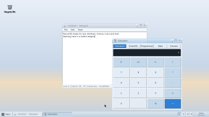</a></td>
<td width="50%"><a href="docs/images/menu.png">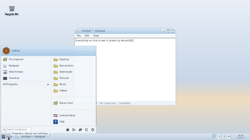</a></td>
</tr>
<tr>
<td><b>The desktop.</b> Two windows over a wallpaper made for this system, in the see-through Glass skin -- the Calculator's title bar has the Notepad behind it.</td>
<td><b>The Apps menu.</b> Pinned programs on the left, the account's own places on the right, All Programs with a fly-out beside it, a search box in the footer. The Notepad's text reads straight through the panel.</td>
</tr>
<tr>
<td><a href="docs/images/control-panel.png">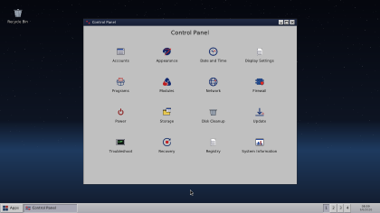</a></td>
<td><a href="docs/images/appearance.png">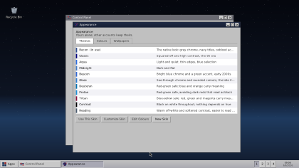</a></td>
</tr>
<tr>
<td><b>The Control Panel</b> is sixteen icons. Each opens in a window of its own, named for the item and stepped clear of whatever opened it, so two settings can be worked on side by side.</td>
<td><b>Appearance.</b> Thirteen skins under four tabs -- the standard set, colour blindness, easier to read, and your own -- so choosing a look is choosing between looks. A skin sets forty-eight semantic roles, the shape of a window frame, and a wallpaper. Any can be copied and changed; none can be deleted.</td>
</tr>
<tr>
<td><a href="docs/images/photos.png">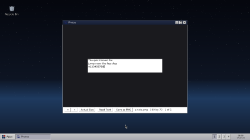</a></td>
<td><a href="docs/images/taskbar.png">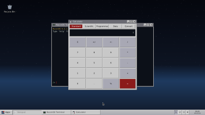</a></td>
</tr>
<tr>
<td><b>Photos</b>, and the two newest things it can do. <b>Read Text</b> pulls the writing out of a picture into a text file. <b>Save as PNG</b> converts any of the seven formats it opens into a lossless one, beside the original.</td>
<td><b>Three states on one bar.</b> Focused, open behind, and put away -- the put-away one has its contents washed back towards its own button. Every pair differs by at least two things, on every skin that ships.</td>
</tr>
<tr>
<td><a href="docs/images/clock.png">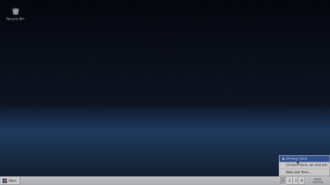</a></td>
<td><a href="docs/images/explorer.png">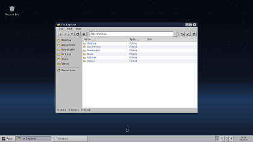</a></td>
</tr>
<tr>
<td><b>The clock's own menu.</b> Twenty-four hour or twelve, with the one in force marked rather than a single entry that toggles -- a label saying what <i>will</i> happen cannot tell you what <i>is</i> happening.</td>
<td><b>ReconOS draws its own windows</b>: the frames, the title bars, the buttons, the menus. The File Explorer is looking at the root of the ReconOS filesystem, which is a real directory tree on disk.</td>
</tr>
<tr>
<td><a href="docs/images/network.png">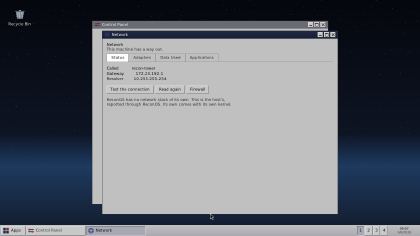</a></td>
<td><a href="docs/images/firewall.png">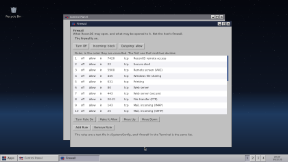</a></td>
</tr>
<tr>
<td><b>Network</b> in four sections, and honest about what it is: ReconOS has no network stack of its own yet, and the page says so where somebody would read it.</td>
<td><b>The firewall</b> is a rule list rather than a page about one -- consulted in order, first match decides, and the ports most people would want are already written down and switched off.</td>
</tr>
<tr>
<td><a href="docs/images/system-information.png">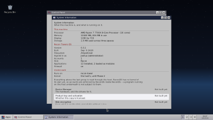</a></td>
<td><a href="docs/images/midnight.png">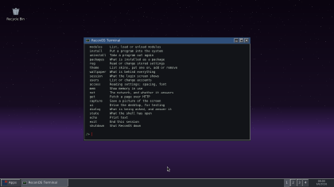</a></td>
</tr>
<tr>
<td><b>System Information.</b> What the machine is, what ReconOS is, and what is underneath -- three groups kept apart on purpose, because the third explains how the first is readable at all.</td>
<td><b>The Midnight skin</b>, with the terminal. The same forty-eight roles, answered darkly.</td>
</tr>
</table>

## What works right now

The full tour -- signing in, the desktop, files, settings, applications, the
network, and how to find out what went wrong -- is **[docs/FEATURES.md](docs/FEATURES.md)**.

It is a long read because it is a list of things that work rather than a
summary of them, and it was two thirds of this file. What it says has not
changed.

## Controls

| Input | Action |
| --- | --- |
| `Alt` + `Enter` | Terminal |
| `Alt` + `N` | Notepad |
| `Alt` + `T` | Task Manager |
| `Alt` + `Tab` | Cycle windows |
| `Alt` + `C` | Close the focused window |
| `Ctrl` + `Alt` + `Del` | Task Manager or shut down |
| `Alt` + `Q` | Quit |
| `F1` | Help, at the page about whatever is in front |
| `Print Screen` | A picture of the screen |
| Any key on the stop screen | Shut down |

Inside the file explorer:

| Input | Action |
| --- | --- |
| `F2` | Rename the selected item |
| `Delete` | Delete it (asks first) |
| `Ctrl` + `X` / `C` / `V` | Cut, copy, paste |
| `Left` / `Right` | Back and forward |
| `Backspace` | Up one folder |
| `F5` | Refresh |

Inside Notepad:

| Input | Action |
| --- | --- |
| `Ctrl` + `N` | New |
| `Ctrl` + `O` | Open |
| `Ctrl` + `S` | Save |
| `Ctrl` + `Shift` + `S` | Save As |

## Building

Requires a Linux system with wlroots 0.17 and its development headers.

```bash
sudo apt install -y build-essential cmake ninja-build pkg-config \
    libwlroots-dev libwayland-dev libxkbcommon-dev wayland-protocols \
    libmbedtls-dev
```

```bash
cmake -S . -B build -G Ninja -DCMAKE_BUILD_TYPE=Debug
cmake --build build
```

A clean build produces no warnings. That is worth keeping: a build with
fourteen warnings in it is a build where the fifteenth is invisible, which is
how Alt+Tab stayed dead for months here. Where a truncation is intended, say
so with `recon_text_copy` or `recon_text_printf` rather than leaving the
compiler to guess.

### Tests

The filesystem operations have their own tests, because renaming, copying and
deleting are what lose a user's work when they are wrong, and clicking through
a desktop is a poor way to find that out. They run against a throwaway root and
need no display:

```bash
ctest --test-dir build
```

Or one suite on its own:

```bash
./build/recon_fs_tests
```

## Running

ReconOS needs direct access to the display, so run it from a bare TTY
(`Ctrl`+`Alt`+`F3`), not from inside an existing desktop session.

```bash
sudo WLR_RENDERER_ALLOW_SOFTWARE=1 XDG_RUNTIME_DIR=/tmp/recon_runtime ./build/ReconOS
```

`WLR_RENDERER_ALLOW_SOFTWARE=1` is required on hardware without a DRM render
node — virtual machines especially. On a machine with working GPU drivers you
can drop it.

To run without a display at all, useful for testing:

```bash
WLR_BACKENDS=headless WLR_RENDERER_ALLOW_SOFTWARE=1 ./build/ReconOS
```

### Installing it somewhere else

To take a build off the machine it was compiled on:

```bash
scripts/package.sh
```

That writes `dist/reconos-<version>-<arch>.tar.gz` containing the compositor,
its assets and an installer. On the target machine:

```bash
tar -xzf reconos-<version>-<arch>.tar.gz
cd reconos-<version>-<arch>
sudo ./install.sh
```

ReconOS lands in `/opt/reconos`, its filesystem at `/recon`, and a `reconos`
launcher on the path. Add `--boot-into` to start it on tty1 at boot instead of
a login prompt; `--uninstall` reverses everything except `/recon`, which is
left alone because it holds your files.

This installs onto a machine that already has a Linux kernel and wlroots. It is
not yet a bootable disk image — that comes with the kernel work, and calling a
tarball an "image" before then would be claiming something ReconOS cannot do.

### Configuration

| Variable | Purpose | Default |
| --- | --- | --- |
| `RECONOS_ROOT` | Where the ReconOS filesystem lives | `/recon`, or `~/.reconos` if that is not writable |
| `RECONOS_ASSETS` | Where the wallpaper is loaded from | the `assets/` dir at build time |
| `RECONOS_CONTROL_SOCKET` | The control socket's path. Created readable and writable by its owner alone; refused if longer than 107 bytes, which is all a Unix socket address holds | `/tmp/reconos.sock` |
| `RECONOS_CURSOR_THEME` | Cursor theme | the system default |
| `RECONOS_NO_SPLASH` | Set to anything to start without the boot splash | unset |
| `RECONOS_FONT` | Font file | the first system font found |

## Layout

```
src/          compositor source
include/      project headers
modules/      applications and subsystems built as .rex / .rts
tests/        tests that need no display
scripts/      build, run, package and install
assets/       wallpaper and icons loaded at runtime
boot/         reconboot — the UEFI bootloader, its own build (clang, PE)
kernel/       the kernel — phase 2, its own build
userland/     the C library, crt0 and the first program to run on that kernel
third_party/  vendored dependencies (stb)
docs/         roadmap, bug register, module interface, development notes
```

## Bugs

**A hundred and eighty-one faults in the desktop and eighty-six in the
kernel** have been found in ReconOS so far. Every one of them has a number --
`BG-001` upward on the desktop, `KF-` on the kernel, assigned in the order it
was found and never reused -- and an entry in [docs/BUGS.md](docs/BUGS.md)
saying what was actually wrong rather than what it looked like.

Two prefixes rather than one because for a while there were two registers: the
desktop and the kernel are built by separate sessions sharing a repository,
both took the next number from the copy in front of them, and twelve numbers
named twenty-four different faults. The kernel's twelve were renumbered and the
file records that it happened, because a register that quietly tidies its own
history is not one.

A commit says what changed. It does not say something was broken, that
somebody hit it, or that it is fixed now. The register does, and the
[issues](https://github.com/neogentrics/ReconOS/issues) carry the dates.
`python scripts/make-issues.py` keeps the two in step.

The interesting ones were found by using the system, not by reading it. Four
faults in the Help window in one sitting; a Calculator that took the whole
desktop down because a struct grew a field and the ABI number did not; every
context menu entry in the system silently doing nothing for weeks because
nothing could press a button without a person there to do it. That last one
is why ReconOS can drive its own input now.

## The kernel

Phase two, built in parallel with the desktop rather than after it. **Version
0.2.5**, handoff protocol **ReconBoot v1**, on the `kernel` branch.

**The middle digit moved on 12 September 2026 because a rule was met, not
because the change felt large.** The rule, written down a day earlier: *0.2.0 is
not reached until every row in sections 1.1 to 1.9 of the blueprint audit is
built*. That is a fact about those tables anybody can check, including a script,
and it is deliberately not a judgement about what counts as a big change.

It is a real kernel and it is not yet a kernel you can run ReconOS on. Both
halves of that sentence matter, so this section says what exists, and then says
what does not.

### What it does

A machine with nothing on it, or with Windows or Linux already on it, boots
ReconOS media, is told where to install, and comes up on its own kernel
afterwards — on either architecture, under either firmware, without GRUB,
without Linux, and without touching what was already on the disk.

| | |
|---|---|
| **Architectures** | x86_64 and aarch64, one portable core behind a six-function boundary the build enforces |
| **Firmware** | UEFI on both architectures, BIOS on x86_64, and device tree with no firmware at all |
| **Bootloader** | `reconboot`, ours. UEFI and a 440-byte BIOS stage 1. It verifies the kernel's signature and there is no way to turn that off |
| **Memory** | Four-level paging, large pages where the processor has them, a direct map, no-execute, TLB shootdown across processors, write-combining for the framebuffer, demand paging and copy-on-write |
| **Processors** | Verified at 1, 2, 4, 8, 9, 16 and 32. Per-processor timers, real preemption, idle threads that cannot be stolen. Built to hold **256**, with x2APIC so identifiers above 255 can be addressed — **untested above 32**, deliberately ahead of a machine to prove it on |
| **Interrupts** | I/O APIC on x86_64, so a device interrupt can be sent to any processor rather than only the boot one; GIC v2 and v3 on aarch64. The switch off the 8259 is verified against the clock and reverted if the tick stops. Message-signalled interrupts are composed and programmed; no driver asks for one yet |
| **Time** | A five-level timer wheel — a callback at a time, or a thread that sleeps without a processor spinning for it — and a worker thread, so an interrupt handler can hand off work it must not do inline |
| **Processes** | A process table, identity, an exit status somebody collects, and an address space each. Programs are **loaded from ELF files** built by the cross linker, not compiled into the kernel |
| **Storage** | virtio, NVMe, AHCI and USB mass storage, over PCI and memory-mapped |
| **Filesystems** | ReconFS, ours — copy-on-write, one atomic commit, 64 ZiB. FAT32 read *and written*, because the EFI System Partition has to be |
| **Files** | A virtual filesystem: descriptors, a mount table, and one interface with the volume, the console, pipes, `/dev`, `/tmp`, `/proc` and a foreign ext2 volume behind it. A program is loaded **from a volume**, and a mapping can be filled from a file |
| **Foreign filesystems** | ext2 read, checked against `e2fsck`, and a repair that rewrites free counts from the bitmaps — because the bitmap is the evidence and the count is the claim. It never happens on mount and must be asked for by the literal word `repair`. EXTENTS, RECOVER and 64BIT are refused **by name** rather than guessed at, which is also why this is not ext4 |
| **Input** | PS/2 keyboard and mouse, and USB HID behind the same interface, so a key is a key whichever wire it arrived on |
| **Between programs** | Pipes, with a reader that waits rather than reporting the end of input; shared memory two address spaces can both reach; and **signals** on both architectures — sent at any time, delivered at exactly one moment, the return to user mode, which is the only instant the kernel both knows where the program was and can still change where it goes |
| **Allocators** | The physical allocator and the kernel heap are locked, which they were not: the comment saying one processor ran kernel code had outlived its own condition by three checkpoints |
| **Installer** | Plans first and writes nothing while planning; then partitions, formats, copies and leaves a disk that boots on its own |
| **Recovery** | The same kernel from the ESP, read-only, offered in the boot menu on every machine |

### How it is known to work

`scripts/verify-kernel.sh` boots the kernel **twenty-five times** on every change — every
firmware, several processor counts, three disk controllers, two CPU models —
and runs the kernel's self-tests on each. Every format it writes is checked by
a tool that did not write it: `sgdisk`, `sfdisk`, `mtools`, and a second
ReconFS reader written from the specification in another language.

The standing rule is that **a test that has never been seen to fail is not a
test yet**. Every checker in the tree has been shown a deliberate fault and
watched to catch it before any pass it reports is believed.

### What hardware it is aimed at

Read from four running machines on 15 September 2026 -- `lspci`, `lsusb` and
Windows' own device list -- rather than from a wishlist. A driver is worth
writing when the part is in the room.

| | desktop | home server | firewall | laptop |
|---|---|---|---|---|
| board | MSI PRO B650-P | Gigabyte AB350 | OPNsense 26.1 | GPU Co. GWTC116-2 |
| CPU | Ryzen 7 7700X | Ryzen 7 1700 | Xeon E3-1225 v3 | Celeron N4020 |
| ethernet | RTL8125 2.5G | 2x RTL8168 1G | `em0` Intel + `re0` Realtek | none |
| wifi | MediaTek RZ616 | -- | -- | RTL8723DU (**USB**) |
| storage | -- | 5 disks, ~14 TB | -- | eMMC, 58 GB |

**Realtek's r8169 family is the first driver target**, and the reason is
arithmetic rather than preference: RTL8125 on the desktop, two RTL8168 in the
server, `re0` on the firewall -- **five ports across three machines**, and
`docs/` already names RTL8139/8169 among the blueprint's NICs. The 8168 is the
r8169 family; the 8125 is its 2.5 Gb successor and shares most of the
descriptor layout. Intel's `em0` on the firewall is the e1000 family, which the
blueprint also names, and is the natural second.

**The server is where a NIC driver should be developed**, not the laptop. Two
identical wired cards mean a driver can be proven on one while the machine
stays reachable on the other.

**WiFi is deliberately not first.** Both parts here need a firmware blob and a
WPA2 supplicant, and the laptop's radio hangs off USB -- so on that machine USB
is the gate on networking as well as storage.

**Only virtio-net is driven today.** Everything above is a target, not a claim.

### What it does not have

This is the honest list, and it is the reason the desktop is not on it.

- **Display.** A framebuffer console on whatever the firmware left. No mode
  setting, no surface for a compositor. This is the one that stands between the
  kernel and the desktop.
- **A way for a program to reach the network.** The network itself is built,
  and so is a socket layer over it — `core/socket.c` has create, bind, listen,
  accept, connect, send and receive. What it has no caller for outside the
  kernel: there is no socket system call and no file descriptor that names a
  connection, so the only thing that opens one today is the network's own
  self-test. Pipes, shared memory and signals exist.
- **EHCI.** xHCI works, hubs are enumerated, and a device plugged in or pulled
  out after boot is noticed (KF-199). Older EHCI controllers are not driven —
  on Joshua's ruling, because USB works on the machines this runs on.
- **A driver for legacy IDE**, which is why a kernel that boots over BIOS from
  an IDE disk cannot then read it (KF-192).
- **ext4.** `core/ext2.c` reads ext2 and refuses EXTENTS, RECOVER and 64BIT by
  name — reading a filesystem through a wrong assumption about where its blocks
  are is worse than refusing to mount it.

Four things this list used to claim are built, and were still listed as missing
until 12 September: **input** (PS/2 and USB HID, `input_init` on every boot),
**signals** on both architectures, **shared file mappings** through the page
cache, and **identity that is enforced** — `open` consults the mode and the
process's user at `core/vfs.c:372` and `:473`. Recorded as a correction rather
than quietly fixed, because a list of what is missing that is wrong in the
direction of understating what is built is the kind nobody goes looking for.

**And it happened again in this same section, six days later.** The network
stack, USB hubs and USB hot-plug all landed on 12 September and were all still
listed here as missing when the kernel branch was merged. A paragraph explaining
why that matters does not stop it; the list has to be read against the tree
every time something lands, which is what the blueprint audit is for.
- **A device that uses any of the new interrupt routing.** The I/O APIC can send
  a device interrupt to any processor and MSI can be programmed, and every
  storage driver still polls — so does the network card: `virtio_net.c` sets
  `enable_interrupts` to null and offers a `poll` instead. The half that was
  missing is built; the half that uses it comes with the first driver that
  wants it.

### Where to read more

- [docs/KERNEL.md](docs/KERNEL.md) — the plan, checkpoint by checkpoint.
- [docs/KERNEL-WANTS.md](docs/KERNEL-WANTS.md) — what the desktop has asked the
  kernel for, ordered by how sharply the gap is felt rather than by difficulty.
- [docs/BUGS.md](docs/BUGS.md) — every fault, what it actually was, and how it
  surfaced. The kernel's share is the majority of the register.


## The C library

`userland/libc/` is written here rather than borrowed, and is tested against
glibc rather than against a specification. See **[docs/LIBC.md](docs/LIBC.md)**.

## Where this is going

Both phases are being built at once now. The desktop keeps growing; the kernel
has begun underneath it. They meet when the kernel can hold a framebuffer and
a filesystem, and the first thing to cross over will be small — a recovery
screen, most likely, because it needs almost nothing but somewhere to draw.

[docs/ROADMAP.md](docs/ROADMAP.md) has the full plan.
[docs/KERNEL-WANTS.md](docs/KERNEL-WANTS.md) is the other half of it: every
place the desktop currently works around not having its own kernel, written
down as it was hit rather than guessed at in advance. That file is the list
the kernel is being built against.

## License

See [LICENSE.txt](LICENSE.txt).
